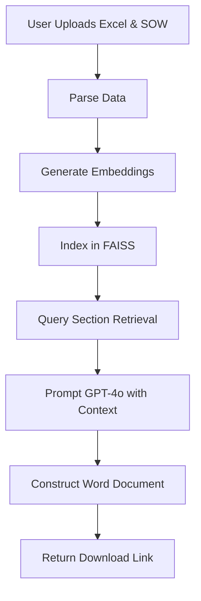

# 📄 BRD Generator Agent

A sophisticated, AI-powered Business Requirements Document (BRD) generator that leverages **Retrieval-Augmented Generation (RAG)** to transform project documents into boardroom-ready reports.

---

## 🚀 Overview

The **BRD Generator Agent** is a professional-grade tool designed for Business Analysts and Project Managers. It automates the creation of high-impact BRDs by intelligently synthesizing information from multiple sources, including **Q&A Excel sheets** and **Statement of Work (SOW)** Word documents.

By combining the semantic reasoning of **Azure OpenAI's GPT-4o** with the efficient similarity search of **FAISS**, this agent ensures that every generated section is grounded strictly in the provided project context, eliminating hallucinations and ensuring technical accuracy.

## ✨ Key Features

- **🧠 RAG-Powered Intelligence**: Uses FAISS vector indexing and `all-MiniLM-L6-v2` embeddings to retrieve the most relevant context for each BRD section.
- **🏢 Executive-Ready Output**: Automatically generates a structured Word document with:
  - Professional Cover Page
  - Executive Summary
  - Scope & Objectives
  - Functional & Non-Functional Requirements
  - KPIs & Governance
  - Timeline & Risk Mitigation
- **⚡ FastAPI Integration**: High-performance REST API for seamless integration with frontend applications or automated workflows.
- **🛡️ Grounded Content**: Strict prompt engineering ensures the AI remains descriptive yet factual, using only the user-provided data.

## 🛠️ Technology Stack

| Component | Technology |
| :--- | :--- |
| **Backend** | Python, FastAPI |
| **LLM** | Azure OpenAI (GPT-4o) |
| **Vector DB** | FAISS (Facebook AI Similarity Search) |
| **Embeddings** | Sentence-Transformers (all-MiniLM-L6-v2) |
| **File Handling** | Pandas (Excel), Python-Docx (Word) |

---

## ⚙️ Installation & Setup

### Prerequisites
- Python 3.8+
- Azure OpenAI API Credentials

### 1. Clone the Repository
```bash
git clone https://github.com/your-repo/brd-generator.git
cd brd-generator/BRD
```

### 2. Install Dependencies
```bash
pip install -r requirements.txt
```

### 3. Configure API Keys
Update the following variables in `BRDfinal.py` with your Azure credentials:
```python
openai.api_key = "YOUR_AZURE_OPENAI_KEY"
openai.api_base = "YOUR_AZURE_ENDPOINT"
DEPLOYMENT_NAME = "your-deployment-name"
```

---

## 📖 Usage

### Running the API
Start the FastAPI server using Uvicorn:
```bash
uvicorn BRDfinal:app --reload
```

### Generating a BRD
Once the server is running, you can access the interactive documentation at `http://127.0.0.1:8000/docs` and use the `/generate-brd/` endpoint.

**Required Inputs:**
1.  **Excel File (`.xlsx`)**: Should contain 'Question' and 'Answer' columns.
2.  **SOW File (`.docx`)**: The Statement of Work document for additional context.

The API will return a `.docx` file named `Generated_BRD.docx`.

---

## 🏗️ Architecture Flow



## 📝 License
This project is licensed under the MIT License. See the [LICENSE](LICENSE) file for details.

---
*Developed with ❤️ for streamlined business analysis.*
